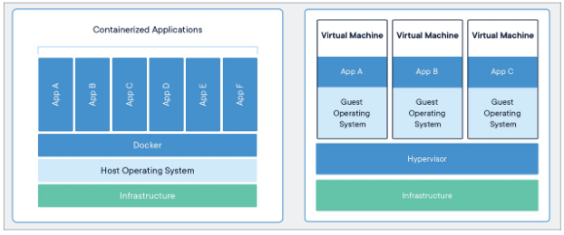
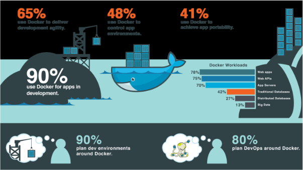
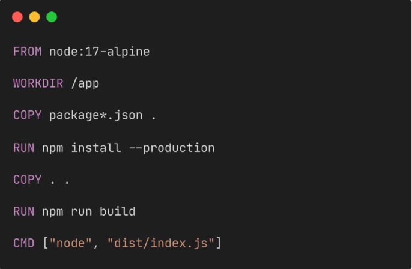
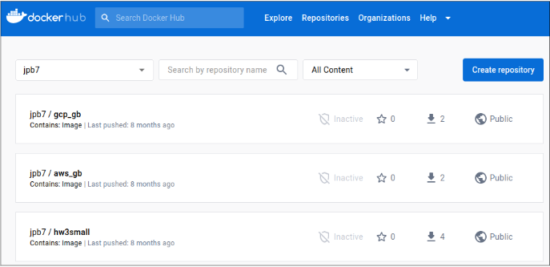
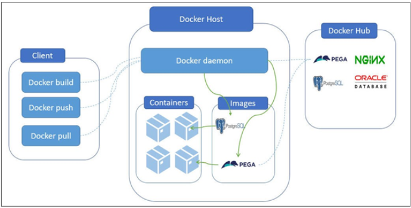
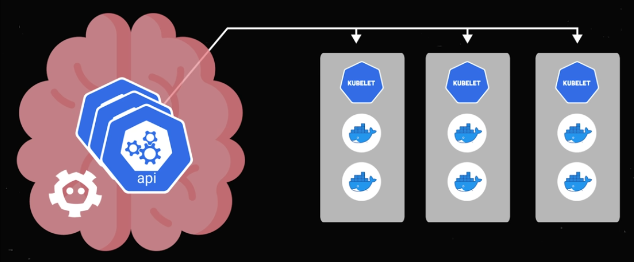
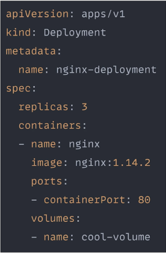
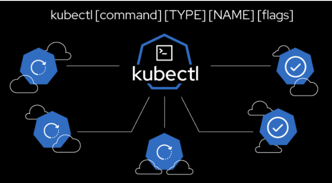

## Containers, Docker, and Kubernetes

Created by Jacob Bentley (jacobpbentley@gmail.com)

### Overview

This section is an introduction to containers, Docker, and Kubernetes. Its purpose is to get all team members up to speed on what these things are and how they work at a high level. Each topic ends with a link to a short YouTube video.

### Containers

Most fundamentally, a container is a standalone piece of software that can run in a variety of different environments. It packages together things like system tools, libraries, settings, and application code so the container has everything it needs to execute.

Containers are often contrasted with virtual machines, which are another virtualization technology that allow you to run a given application independently of the underlying operating system. The main difference between the two is that containers are a lot smaller and more portable.



A virtual machine has its own entire guest OS which accesses hardware resources by means of a hypervisor, which is itself provided by a host OS. So if you want to run a single application written for Windows, you’ll need all of that in place on a physical machine somewhere. This is pretty resource-intensive and is often not desirable, especially when you’re paying a cloud service like GCP or AWS on a per-resource basis.

With a container, on the other hand, you can give the container itself all the Windows-specific components it needs, and then run it on any machine with a compatible container engine like Docker. It doesn’t matter whether that machine is running Docker using Windows, Linux, Mac, or [TempleOS](https://en.wikipedia.org/wiki/TempleOS) (okay, maybe not TempleOS): it can still run your containerized, Windows-based application just fine.

This is a huge advantage in the modern computing environment where containers are often moved from machine to machine and data center to data center.

Containerization Explained:
https://www.youtube.com/watch?v=0qotVMX-J5s

### Docker

The container runtime (or engine) provides an interface between containers and the host OS. There are some cool details we could discuss about the resource sharing and filesystem hacks that make this possible, but essentially the runtime is what allows containers to run anywhere.

It’s worth noting that Docker is by far the most widely used container runtime.



There are three main components when it comes to Docker:

- Dockerfile
- image
- container

The Dockerfile defines a given image. It’s basically a snapshot of all the software that’s bundled up for a given container. That image can be stored locally but is often pushed to a remote repository like [Docker Hub](https://hub.docker.com/), where it can then be pulled down by whatever machine might need it. In any case, the image is used to spawn running containers.

So to make the nomenclature clear: an image is all the software included in a container, and a container is a running instance of that image. It’s similar to the distinction between a program and a process.

Below is an example of a Dockerfile. They tend to be pretty short and sweet.



Alpine Linux is a popular base layer for containers because of its small size. The base layer provides the most OS-y of the container’s software, so generally speaking, the smaller the better.

The other commands aren’t all that important for our purposes here. Basically they designate a working directory within the container, copy files from the host filesystem to that working directory, and then execute some commands within the container after performing the copies. The final line designates the command to be executed upon starting the container.

This is a pretty typical set of operations for a Dockerfile. For what it’s worth, I haven’t seen too many that are more complicated than this.

To build an image from this Dockerfile on the local machine, you would run:

```
docker build -t my-app-iamge .
```

You would then tag it according to your username and the name of your repository on Docker Hub:

```
docker tag <image-id> <docker-hub-username>/<repository-name>:<tag>
```

And finally, you’d actually push the image:

```
docker push <docker-hub-username>/<repository-name>:<tag>
```

If you were to then log in to the Docker Hub site, you’d see something like this:



In order to pull the image down, say, to another machine, you’d run:

```
docker pull <docker-hub-username>/<repository-name>:<tag>
```

And finally, to actually run a container from that image:

```
docker run <docker-hub-username>/<repository-name>:<tag>
```

Here’s a visual representation of the above which may or may not be helpful.



And here’s a short YouTube video explaining all of this better and more succinctly.

Docker in 100 seconds:
https://www.youtube.com/watch?v=Gjnup-PuquQ

### Kubernetes

Containers allow us to deploy software in self-contained chunks, and Docker defines and interfaces with those containers at a low level – Kubernetes, then, manages containers in concert with each other to achieve deployment across multiple machines. It is often referred to as a container orchestrator, analogous to the conductor of an orchestra.
Why Kubernetes?
The main advantage of Kubernetes is that it allows you to deploy large numbers of containers across multiple machines. Another important, related benefit is that Kubernetes gives you the ability to automatically scale your deployments up and down according to demand or to the health of those deployments.

In the first case (scaling according to demand), it’s important to note that the workload of any given app or service will vary quite a bit over time. A frontend application, for example, might be serving just a handful of users at one point, and then suddenly hundreds of users a few moments later. Scaling that example up, if I’ve deployed two instances of my containerized frontend, with one of them maxed out and the second approaching capacity, I’ll want to deploy a third instance to continue serving users.

Further, I might want to balance traffic across those three containers instead of maxing out two of them and then throwing everything else at the third. More importantly, I don’t want to be hovering over my deployments and making these interventions manually. They tend to be so variable that it would be a nightmare to write scripts for all the different conditions and scenarios. This is where Kubernetes comes in: you can automate the above actions so that Kubernetes will detect these changing conditions and immediately reconfigure the deployment accordingly.


In the second case (scaling according to the health of a deployment), it’s probably easy to appreciate how much can go wrong when it comes to deploying pretty much anything, and especially when you’re deploying hundreds or thousands of containers. Sometimes it might be a hardware problem (an old hard drive in a data center breaks down); sometimes it might be a software problem (one of your containerized applications fails catastrophically and can’t recover on its own).


The point is, things are inevitably going to break, and so we need a way to quickly and easily recover. Given the interchangeability of containers, it’s almost always easier to simply kill whatever instance has failed and replace it with another. In Kubernetes this is called self-healing.

### Components of Kubernetes

Kubernetes has a lot of moving parts. I’m going to start at the highest level and work my way down. The jargon isn’t immediately intuitive, so don’t worry if it takes multiple repetitions to remember which thing is which.

Starting at the top, a cluster is a set of nodes which each run some containerized application. So a cluster is a Kubernetes abstraction that refers to some group of related containers running on separate compute resources. For our purposes here, consider a node to be a distinct machine – probably a server somewhere in a data center.

The control plane manages the cluster, exposing an API server that enables communication among the various nodes. Those nodes each have a running kubelet that is used for this communication. The kubelet runs a container engine (eg. Docker) and also manages a group of pods: each pod is made up of one or more containers.



There’s a lot going on here under the hood: networking, persistent storage, secret management, etc. We’ll have time to get into the nuts and bolts later on, to whatever extent is warranted by the project. I think two additional things should be mentioned before wrapping this up: manifests and kubectl.

### Manifests

A lot of the magic of Kubernetes is derived from the power and simplicity of its manifests, or YAML files. Basically, you write a YAML to define the resources you want in your cluster as well as the state those resources should be in. You then submit that manifest to the API server, which will then deploy your cluster as described; something called the controller manager will then ensure that the cluster maintains the state specified in the YAML.

The key benefit here is that YAML files are declarative manifests as opposed to imperative scripts. In other words, they’re much simpler, more readable, and less error-prone than configuration scripts. They use key-value pairs and tabbed lists to describe resources and desired states. See the example below, and imagine a Bash script for contrast.



#### kubectl

If you’re really hands-on managing a deployment, you’re probably going to be using kubectl. kubectl is the command-line tool for interacting with Kubernetes clusters. I’m definitely no expert on it, but I know that time invested in it will make your DevOps life much easier and more productive.
Here are some of the key features and functions of kubectl:

- Resource management
- Cluster operations
- Deployment and rolling updates
- Pod and container operations
- Inspection and monitoring
- Debugging and troubleshooting
- Context and configuration management

Since we’re starting to go beyond the scope of a conceptual overview, here’s a link to the official documentation: https://kubernetes.io/docs/reference/kubectl/.



Finally, here’s a link to a good, short video that covers everything above:

Kubernetes in 100 seconds:
https://www.youtube.com/watch?v=PziYflu8cB8

### Relevance to WonderTix

The WonderTix project is already containerized. The clearest view of this is given by the docker-compose.yml file at the top level of the GitHub repo.

It configures the environment surrounding each container, including networking and authorization data, and builds the actual server and client images using Dockerfiles in the corresponding directories. It also pulls down a PostGres image from Docker Hub. Each of these images, then, is used to run the backend, application, and database services as containers.

For our purposes, this setup is probably sufficient given the relatively low amount of traffic handled by the current PPH site. Using containers in this way makes it easy to configure and connect each of our various components.

However, it’s not the most flexible or resilient use of containers. With a little more segmentation, it would be possible to, say, scale instances of the frontend application without also scaling the backend. This might be desirable behavior depending on the conversion rate of visits to the PPH site versus ticket purchases or donations.

With Kubernetes, on the other hand, we could scale each of our services (frontend, backend, and database) independently of each other according to demand. So if our frontend is slammed but the backend is relatively unbothered, we could run additional containers from the application image to handle the frontend traffic without having to spend additional money or resources on spawning additional backend containers.

### Other tools and solutions

It’s important to note that there are other tools we could use in place of Kubernetes. For now, docker-compose is doing just fine in terms of defining and building our various containers, as well as connecting them to each other. Its main drawback (as far as I understand) is the lack of automatic scaling and healing: if demand increases too much, or if the VM stops working for whatever reason, service will be interrupted. The [documentation itself](https://docs.docker.com/compose/) states that docker-compose is intended primarily for testing and development, not production.

A more direct alternative to Kubernetes would be [Docker Swarm](https://docs.docker.com/engine/swarm/). Swarm would allow us to scale and heal multiple instances of our complete application on a single VM. This solution warrants a closer look due to its relative simplicity versus Kubernetes, and the fact that we are unlikely to need multiple nodes. In other words, we want to be able to auto-scale according to demand and heal when failures inevitably happen, but we don’t necessarily need all the features that Kubernetes provides.

Finally, it’s worth taking a look at using [Managed Instance Group](https://cloud.google.com/compute/docs/instance-groups/) (or MIG) of VMs. As far as I understand, this is a coarser solution in terms of scaling and healing since we’d be using entire VMs instead of containers. I’m guessing the costs reflect that coarseness (ie. would be greater), but I could be wrong.

### Recommendations

For now, I think it’s sufficient to deploy the project as is to a single virtual machine. That way, even if we end up using Docker Swarm or a Kubernetes cluster, we can at least get the project up and running with a single VM. This will allow us to push changes and see immediate effects in a deployed environment; it will also allow us to prioritize building our CI/CD pipeline. Depending on progress there, or division of labor among the deployment team, we could then turn our attention to Docker Swarm or Kubernetes.

As for recommending one of those over the other, I have to admit that Kubernetes seems like overkill for our use case. Typically Kubernetes is used for large-scale deployments that span multiple machines, consume a lot of resources, and have a lot of moving parts. Our project is much simpler and, from what we’ve heard at this point, has a pretty manageable amount of traffic.

I’d say we should look more into Docker Swarm so that we can automate scaling and healing moving forward – but for now we should be able to get up and running with the current Docker Compose configuration.

### Questions

- Is it worth future-proofing or going overboard just to get experience with an important tool like Kubernetes?
- Assuming it makes sense technically, how much would it cost to use something like GKE over Docker Swarm?
- Not necessarily related to the topic at hand, but how committed are we to GCP? Because it looks like the Terraform configuration is all set to deploy to AWS.

### Resources

##### Videos

Containerization Explained: https://www.youtube.com/watch?v=0qotVMX-J5s
Docker in 100 seconds: https://www.youtube.com/watch?v=Gjnup-PuquQ
Kubernetes in 100 seconds: https://www.youtube.com/watch?v=PziYflu8cB8

#### Documentation

Docker: https://docs.docker.com/
Docker Desktop: https://docs.docker.com/get-started/hands-on-overview/
Docker Compose: https://docs.docker.com/compose/
Docker Swarm: https://docs.docker.com/engine/swarm/
Managed Instance Groups: https://cloud.google.com/compute/docs/instance-groups/
Kubernetes: https://kubernetes.io/docs/home/

#### Price calculators

AWS: https://calculator.aws/#/
GCP: https://cloud.google.com/products/calculator
