## WonderTix Deployment Guide

Created by Jacob Bentley (jacobpbentley@gmail.com)

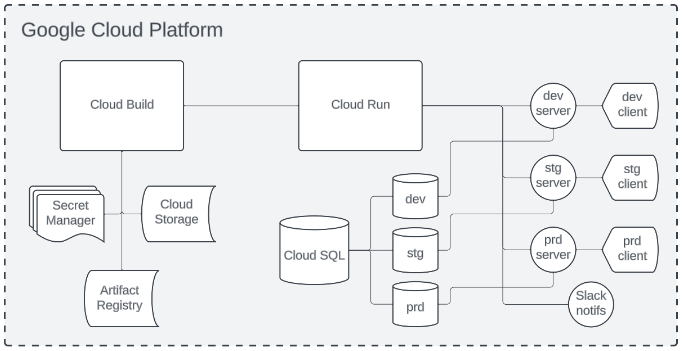

### Introduction

This document provides a walkthrough of the WonderTix deployment on Google Cloud Platform (GCP). Its purpose is to describe each of the main components and provide some instructions for common or important tasks. Where appropriate, additional details can be found in separate, linked documents.

### The Big Three

The three most important services in our GCP architecture are Cloud Build, Cloud Run, and Cloud SQL. We’ll go through each of them in turn, or you can click one of the above links to jump straight to that section.

### Cloud Build

#### Triggers and workflows

Cloud Build is the link between our GitHub repo and the rest of GCP. It’s how our code gets packaged up into a deployable form and sent over to Cloud Run, which does the actual deploying. It does this primarily through the use of triggers (pictured below).


Each of our triggers is pointed at a given workflow. The conventional name for these workflow files is cloudbuild.yaml. You’ll find several of these workflows sprinkled around the GitHub repo, but the most important three are located at the root level, in the client directory, and in the server directory.

- cloudbuild.yaml (root): runs our main test-and-deploy pipeline, which builds both the client and server, runs E2E tests on them, and then deploys them.
- client/cloudbuild.yaml: builds and deploys the client.
- server/cloudbuild.yaml: builds and deploys the server.

When you run any of the triggers pictured above, you run the corresponding workflow in the Build configuration column. It’s important to note that these triggers and workflows aren’t necessarily limited to building: they can be used to do any number of tasks depending on context. The main thing is that each trigger is used to run a particular workflow, but we’ll get more into workflows in a bit. First let’s talk about the actual building.


#### Building Docker images

When we talk about building in these documents, we’re talking about building Docker images. We have a basic primer for Docker and containerization in general, so be sure to check that out if you need a quick introduction to the topic. The tl;dr is that Docker images are self-sufficient packages of software that can be used in most common environments. An image is used to run containers: the relationship is similar to that of a program’s source code versus its running instances. We build Docker images using a Dockerfile.

Dockerfiles are often named just that, Dockerfile, and are simply sets of instructions for building particular images. They tend to be short and sweet but can get more complex if you try to make the resulting image as small as possible (which has numerous downstream benefits we can get into later).

#### More on workflows

So any time one of our workflows refers to “building,” it’s building a Docker image from a Dockerfile. I reiterate this because it might not be obvious at first glance. For example, here’s the build step of our `server/cloudbuild.yaml`:

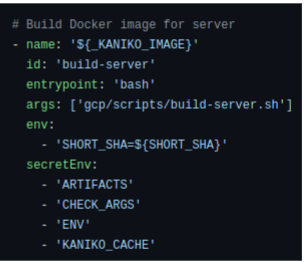

I guess the comment here is well-placed and kind of a giveaway, but the point is these workflow steps are pretty terse. Nowhere in the actual code do you see the words Docker or Dockerfile, and yet this step is basically a glorified `$ docker build` command that builds an image from a Dockerfile.

Part of the reason this step doesn’t mention Docker is that we’re actually using Kaniko to build the image, but we’ll get to that in a moment. For now let’s go through each `key` in the build step to the left.

  **name**
    The - indicates the beginning of a distinct step within the workflow. name is used to specify a container image that will be used to run that step. Most often we’re pulling these from Artifact Registry, but not always. In this case we’re using a substitution variable ${_KANIKO_IMAGE} to hide the location of our custom Kaniko image from public view.

**id**
Used to assign a brief string identifier to a given step. It prepends this identifier to lines of the build logs but, more importantly, allows you to specify the execution order of steps when combined with the waitFor key (not pictured, but used extensively in our root-level cloudbuild.yaml).

**entrypoint**
Indicates the command to be executed upon starting a container from the image in the name key. We use bash pretty much exclusively for the purpose of executing shell scripts.
args
Specifies arguments to be passed either to the container’s default command or to the entrypoint explicitly declared. This is where we typically pass in paths to the shell scripts stored in the gcp directory of the GitHub repo.

**env**
Lists environment variables to be passed to the container. We use SHORT_SHA a lot: it’s a default Cloud Build substitution variable that uses a shortened form of a Git commit hash. In other words, we use it to associate a given build and deployment with a particular commit in our Git repo. We have to pass it to the container here because SHORT_SHA is not passed by default to the bash script we’re running.

**secretEnv**
Passes secrets from `Secret Manager`. This one is a bit loaded in our context, but essentially these are just more environment variables to be passed to our container and script. Not everything we pass in this field is a proper secret that needs to be encrypted: most often, in fact, it’s just a regular environment variable. More on that below.

#### Secret Manager

Our use of secrets in these workflows is, arguably, a bit hacky. Like I mentioned above, many of the “secrets” we’re passing in aren’t exactly sensitive data. For example, CHECK_ARGS in the previous example is actually just the path to a bash script. We use Secret Manager for two main reasons, outside of encrypting actual secrets:

- to centralize our environment variables in one place, minimizing reliance on substitution variables,
- to enable re-use of the same cloudbuild.yaml files across multiple environments (development, staging, and production).

The pivot on which all these secrets turn is the ${_ENV} substitution variable. It allows us to pass in the three-letter identifier for a given environment – dev for development, stg for staging, or prd for production – and retrieve all of the environment variables for that environment.

We can see an example of this at the bottom of our server/cloudbuild.yaml, and at the bottom of our three main `cloudbuild.yaml` files:

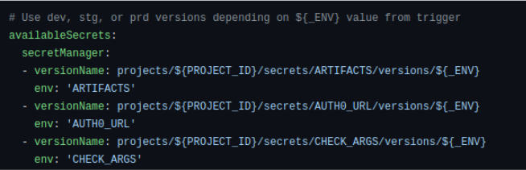

The `versionName` key specifies a particular version of a secret. The ${_ENV} substitution variable will specify the environment identifier such as dev. In that case, the version of the ARTIFACTS secret corresponding to the dev **alias** will be retrieved and made available within the workflow as the environment variable specified on the next line, using the env key. This identifier can then be used in the above secretEnv keys to pass secret values to containers and bash scripts.

To show you what I mean by **alias** in this context, here’s the console page for the ARTIFACTS secret in Secret Manager:

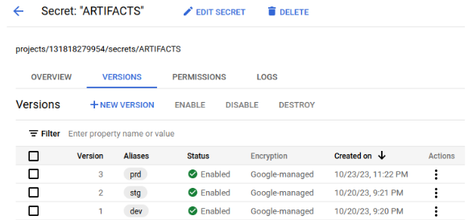

As you can see, there are three versions of this secret: one each for dev, stg, and prd. If you click on the little stoplight icon in the Actions column over on the right, you can view that version of the secret value. Clicking on View secret value will display, in plain text, the value of that secret.

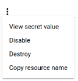

Note: you can substitute secret values directly in certain lines of the workflow itself, but you must use a special `$$` syntax. So if, for some reason, you wanted to specify a path to a bash script using a secret substitution, you could insert `$${PATH}` into the args line of a given step.

Because our use of Secret Manager is so extensive, we might someday create a separate document that serves as a guided tour.

#### Substitution variables

Variables which are specific to a given Cloud Build trigger and which use the `_` prefix are called substitution variables. You can see `–` and set `–` them by clicking on Run to the right of a given trigger on Cloud Build. This will bring up the Run trigger sidebar. On the bottom part of that sidebar, you can see the values for `${_ENV}`, which we’ve already talked about, and `${_KANIKO}`. I’ll talk more about Kaniko next.

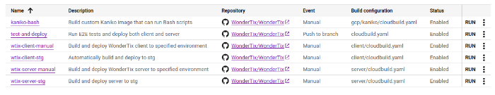

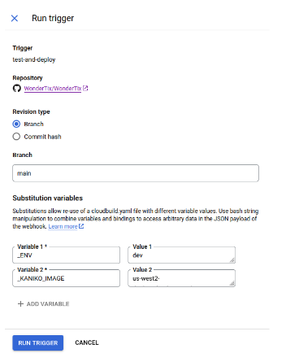

#### Kaniko

Kaniko is a tool for building Docker images from within containers. In that context, it offers some performance advantages over Docker-in-Docker builds, but our main interest in it here is its use of layer caching.

Docker builds an image layer by layer, where each line of the Dockerfile corresponds to one layer of the resulting image. Kaniko takes advantage of this by keeping a cache of layers – in our case, in Artifact Registry – and pulling layers from that cache whenever they haven’t changed and don’t need to be rebuilt.

You may have noticed that we have a `gcp/kaniko` directory in our repo. This contains a single Dockerfile and `cloudbuild.yaml`. These are linked to a manual trigger in Cloud Build called `kaniko-bash`: running that trigger builds a custom Kaniko image that includes bash and pushes it to Artifact Registry.

The reason this exists is that – at least as far as I knew a couple of weeks ago – Kaniko was simply an executable, not an official Docker image, and therefore isn’t on its own capable of running our bash scripts as entrypoints.

That was before I found this: https://github.com/GoogleContainerTools/kaniko#debug-image.

So there’s an easy improvement to make to our GCP setup. If we instead pull that Kaniko debug image, we can ditch the `kaniko` directory entirely and get our substitution variables back down to `${_ENV}` alone.

Speaking of pulling images, let’s finally talk about Artifact Registry.

#### Artifact Registry

Whenever Cloud Build pushes an image or a layer cache for Kaniko, it pushes it to the Artifact Registry. The Artifact Registry contains a number of different repositories pictured below.

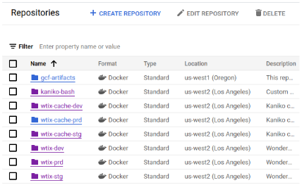

Three of these are for Kaniko layer caches; the bottom three contain directories for builds of the server and client, respectively.

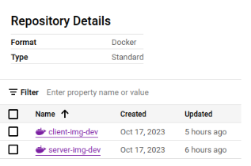

#### Cloud Storage

For miscellaneous storage across builds, we use Cloud Storage. Cloud Storage is organized into buckets, each of which can contain various files and directories. Here are a few of ours.

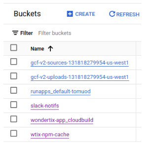

The two worth noting here are slack-notifs and wtix-npm-cache. The former holds a YAML and JSON related to our Slack notifications, and the latter caches a package.json and a compressed tarball holding the WonderTix client’s node_modules directory.

The wtix-npm-cache is basically what it looks like: a jury-rigged caching mechanism for persisting client Node.js packages across builds. It speeds up our builds by obviating the need for a prolonged $ npm install command when running our E2E tests.

#### Scripts

Let’s revisit the build-server step from our server/cloudbuild.yaml.

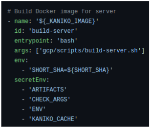

We’ve already covered the following about this step:

- It pulls our custom Kaniko image from the Artifact Registry.
- It runs bash on that container and passes it the path to a script.
- It passes several environment variables into the container for use by the script.

We haven’t, however, talked much about the script being executed.

More than any particular script, what’s important to know is that all of the scripts in the gcp/scripts directory of our repo do what their names suggest: `build-server.sh` builds a server image, `deploy-client.sh` deploys a client container to Cloud Run, and so on.

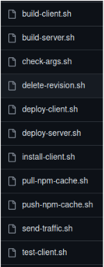

Here’s the contents of `build-server.sh`, just for clarity.

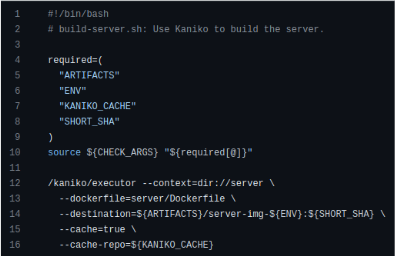

This is the basic pattern of each of our existing bash scripts: they include a brief header comment, an array of required arguments along with a somewhat cryptic invocation of the check-args.sh script, and then a command. Most of the time it’s a gcloud command, but in this case it’s Kaniko. All of these scripts are effectively wrappers for what used to be inline bash commands that were entered directly into our workflows. Sequestering them as scripts was done primarily for modularity, then for readability, and finally for maintainability (because the multi-line syntax can be finicky). Sort of as an afterthought, they’re also used for error checking.

Note the use of environment variables to parameterize the command at the bottom of the script. This, along with our aliasing to dev, stg, and prd in Secret Manager, is pretty much the heart of our approach to Cloud Build. This is what allows us to re-use the same cloudbuild.yaml files to deploy to any of our three environments.

Okay, speaking of deployments, I think we’re finally ready to talk about Cloud Run.

### Cloud Run

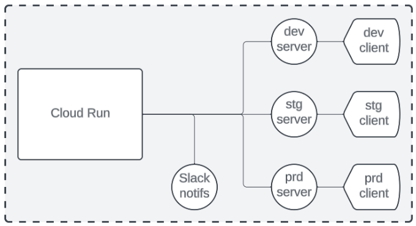

#### Services

We have seven services deployed on Cloud Run, as pictured above. In the GCP console, they look like this:

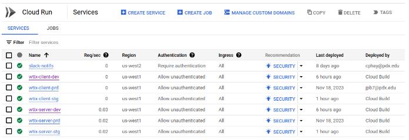

Most of the time, you’ll want a particular client or server for dev, stg, or prd. Clicking the service name will bring up more detailed information and options: by default this will take you to the METRICS tab, but again, most of the time, you’re probably going to want REVISIONS.

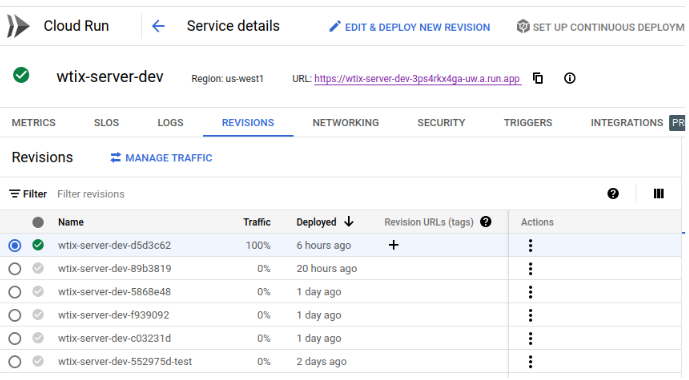

To check the browser interface for the revision, click the URL in the top-right part of this screen. Note that for the client, you’ll instead want to use https://dev.wondertix.com, https://stg.wondertix.com, or https://www.wondertix.com for dev, stg, or prd respectively.

#### Revisions

Each of the rows in the table above is a revision. The short hash at the end of the revision name associates the revision with a particular commit from the GitHub repo: this is the result of our use of ${SHORT_SHA} in Cloud Build. Clicking the stoplight icon on the right gives you a few important options.

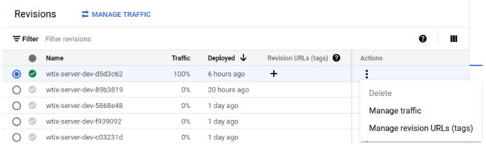

Note that you can’t delete the latest revision, even if it’s not receiving traffic.

#### Traffic

Traffic can be distributed among different revisions using Manage traffic above. For our purposes, this tends to be an all-or-nothing state: either a revision receives 100% of traffic or none at all. (Earlier in the project, however, when our client started up much slower, we had to shift traffic gradually in order to avoid the worst of our cold starts.)

Most of the time our send-traffic.sh script takes care of directing traffic from within our workflows. If, in the future, traffic management needs to become more granular, that script uses a PERCENTAGE environment variable that can take some value other than 100.

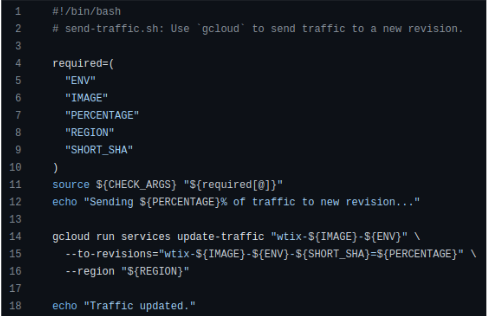

In other words, if you’re having to redirect traffic manually something has gone wrong, and in those cases, you’ll definitely want to check out the Cloud Run logs to get more information. You can do that by clicking the LOGS tab from the service’s details page.

#### Logs

Here’s a good example of why the logs are important. As I write this document, there’s an ongoing authentication error with our Stripe webhook:

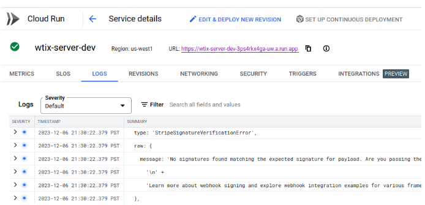

Typically if you’re having some kind of configuration error with WonderTix or a problem integrating the server or client with some other component, this is the first place you’ll want to check. From there you can find additional logs more specific to the issue, whether that’s in Cloud SQL or, in this case, on Stripe.

Sometimes in the course of fixing a Cloud Run service, you’ll want to re-deploy without necessarily re-running the corresponding workflow. To do that you can perform a manual rollback.

#### Rollbacks

In our experience, rollbacks took two main forms:

- Simply redirecting traffic to an older, known-good revision, or
- Re-deploying a revision entirely.

You’ll usually want to delete any problematic revisions to make sure you don’t accidentally roll back to them in the future.

As a simple example, let’s pretend the first revision here had borked and we wanted to roll back to the second revision.

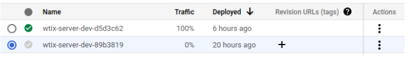

The first step would be to click on the stoplight icon to the right under the Actions column and select `Manage traffic`. This will bring up a modal which allows you to allocate a percentage of traffic among revisions.

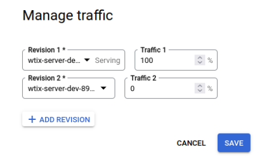

The next step would be to send 100% of traffic to that second revision, and that’s pretty much it unless you also want to clean out the broken revision.

If you want to delete the broken revision and it’s the most recent one, you’ll have to deploy a new revision first. You can do this by running a workflow or by clicking `EDIT & DEPLOY NEW REVISION` the upper right part of the Service details page.

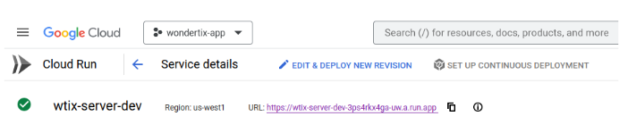

This will bring up the following menu, which contains a lot of details about the revision:

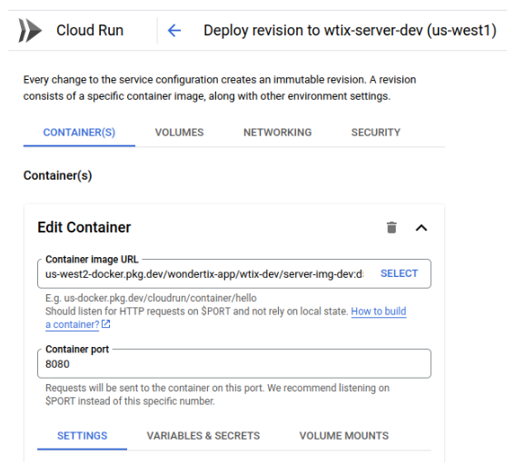

Unfortunately there’s too much in this menu for me to cover in this document. In general, though, you can come here to inspect or change settings related to containers (such as resources, secrets and variables, or volumes and mounts), networking, or security. 

**Important caveat:** any changes you make using this interface will be inherited by subsequent deployments unless they are explicitly overwritten by the deploy steps of our workflows.

Once you’ve made any needed changes, or right away if you’re simply rolling back to a known-good revision, scroll down to the bottom of this screen and click `DEPLOY`. Make sure to check the box next to `Serve this revision immediately`.

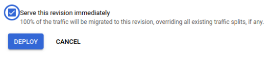

#### Tags

Tags are a bit of a misnomer: they can be used simply to label a certain revision, as the name suggests, but more importantly, they allow you to specify a particular URL for that revision. Here’s an example you’ll see if you watch Cloud Run while our test-and-deploy trigger runs:

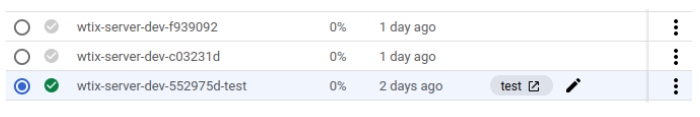

During the course of that workflow, we tag certain revisions as test in order to assign them a particular URL – in this case, https://test—wtix-server-dev-3ps4rkx4ga-uw.a.run.app – so that we can run E2E tests on that URL instead of the live version of WonderTix.

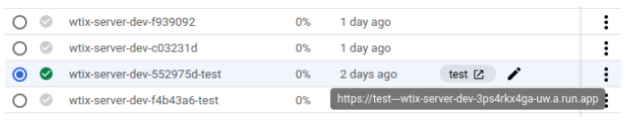

This tag is handled by special logic in our `deploy-client.sh` and `deploy-server.sh` scripts. Note that the `-test` suffix on the revision name is not redundant: it is used to delete test revisions at the end of a successful workflow. However, sometimes workflows fail or are interrupted; in those cases, these test revisions will hang around in Cloud Run.

In the future, it would be nice if we automated clean-up procedures to handle this kind of thing. For now, though, the extra revisions don’t hurt anything so this is kind of a wish-list item.

#### Resources

Every once in a while you’ll run into resource-related problems with a particular service. For us, this consisted almost exclusively of low memory errors: first with the client (back when it was huge and had cold-start problems), and later with the server in relation to the database (it needed more memory in order to seed properly).

You can change this manually in the `EDIT & DEPLOY NEW REVISION` menu described above, specifically here:

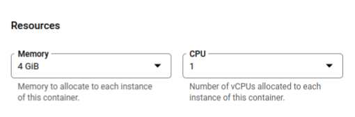

But it’s better to change the relevant values in Secret Manager to ensure the changes will persist across subsequent deployments. For the server we’ve been looking at, you’d want one or both of these two secrets:

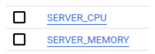

Clicking on `SERVER_MEMORY` above shows you the following screen, where you can add a new version and then alias it to the appropriate environment.

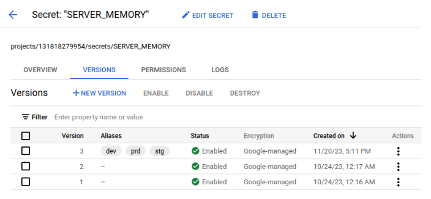

This will substitute the new value into the gcloud command made by the `deploy-server.sh` script.

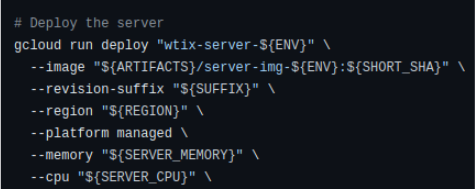

#### VPC connector

It’s worth pointing out that our Cloud Run revisions are all routing private traffic through the default Virtual Private Cloud (VPC). This is primarily to secure their communication with the databases, although it will also allow us to set up Identity-Aware Proxy (IAP) in the future to control access to our dev and stg environments.

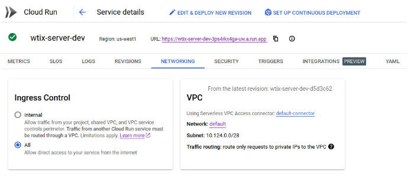

### Cloud SQL

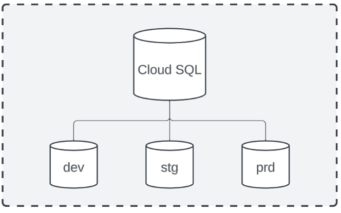

#### Instances

We’re using three separate SQL instances for each of our three environments: dev, stg, and prd. Respectively, these instances are named wtix-db-dev, wtix-db-stg, and wtix-db-prd.

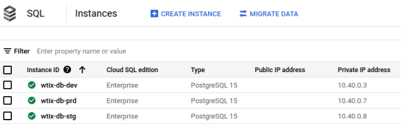

These instances are used to perform automated management, including backups and networking, for one or more databases. All of our instances use private IP addresses, so even if you use the right credentials, you won’t be able to connect to them from outside GCP.

#### Databases

Clicking the `wtix-db-dev` instance on the screen above will take you to the overview for that instance.

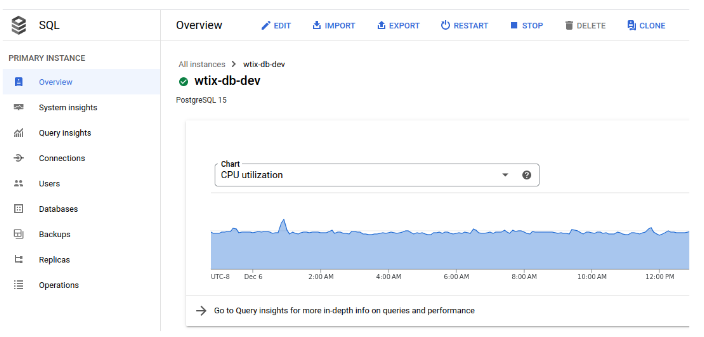

From there you can click Databases on the sidebar to see its actual databases.

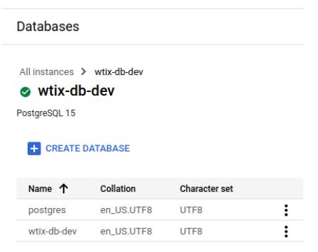

By the usual GCP standards this screen is almost completely barren, but it does at least allow you to create or delete databases. For any database operations more fine-grained than that – such as connecting to the database and executing psql commands – you’ll want to use our connector VM.

#### Users

In order to connect to one of these databases, you’ll have to authenticate as the database user for that environment: `wtix-dev`, `wtix-stg`, or `wtix-prd`. These are stored in Secret Manager as the secret `DB_USER`.

Each of these has their own password stored in `DB_PASSWORD`. In fact, any of the environment variables connected directly to the databases should be prefixed by `DB_` (with the apparent exception of `DATABASE_URL`).

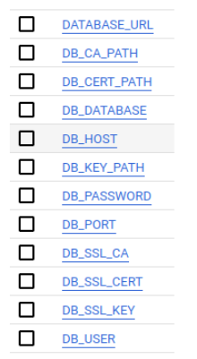

#### Connector VM

Because our Cloud SQL instances are configured for private IP, you have to access them from a resource that’s on the same VPC. We created a dedicated virtual machine in Compute Engine for this purpose.

To view it, find Compute Engine on the main GCP sidebar (or type it into the search bar), and click on `VM instances`.

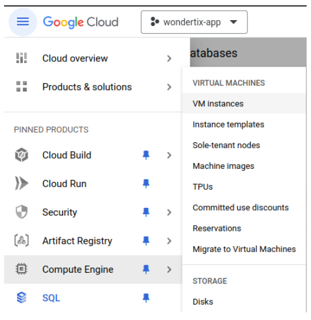

You should see the following from there:

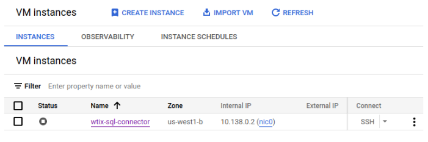

The VM should be stopped by default. To turn it on, click the checkbox followed by `START / RESUME` (which should appear once the VM is checked).

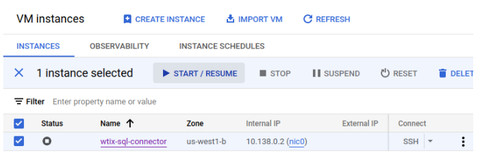

Once it’s started and you see the green check under the Status column, click on SSH in the right-hand column that says `Connect`.

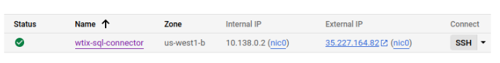

This will open a pop-up asking you to authorize SSH-in-browser.

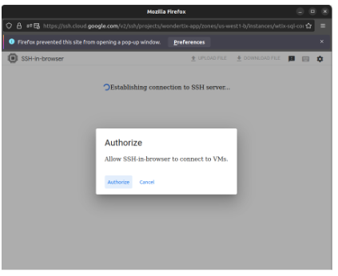

You should then see a terminal.

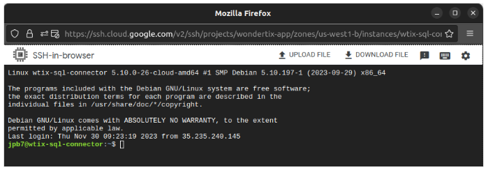

To connect to the dev database, use the following command:

```
$ psql -h 10.40.0.3 -U wtix-dev -d wtix-db-dev
```

For the password, go into Secret Manager, scroll down and click on `DB_PASSWORD`, and then click the stoplight icon to the right of the version using the dev alias. Then click View secret value, copy the plaintext password in the resulting dialog, and paste it into your SSH session.

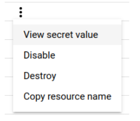

You should now be connected to the database.

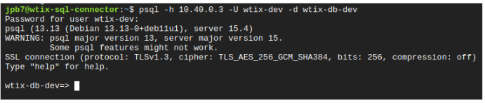

For detailed information about resetting a database, see reset-db.md.

After you’re done with the database, end the SSH session and make sure to **power down the VM**. There’s no reason for it to continue to run, and we get billed by GCP for every minute that it’s up. Select the checkbox next to the VM and then click `STOP` in the upper right.

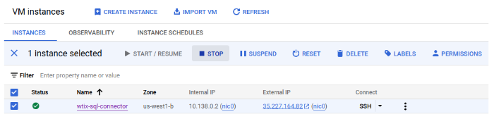

GCP will try to scare you with a message about corrupted disks, but you should stop the VM, anyway.

#### Networking

Network and security configuration for a Cloud SQL instance can be found on the Connections tab of the sidebar.

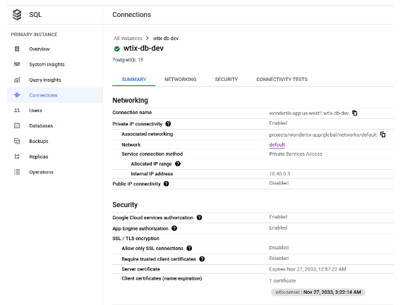

Note again that public IP is disabled. For details on private IP, click on the `NETWORKING` tab.

This is where our VPC is specified (in the Network dropdown).

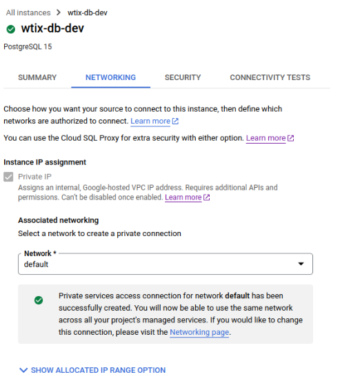

One task we didn’t quite finish by the end of this capstone project was to set up SSL encryption between our databases and servers. This can be completed on the `SECURITY` tab using the settings under `Manage SSL mode`.

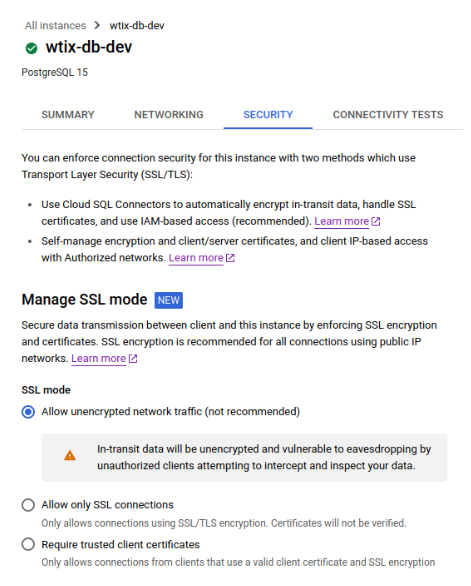

#### Prisma

There’s a lot that could (and should) be said about Prisma in this document, but in the interest of time we’ll have to settle for a few quick notes.

At the time of this writing, Prisma operations are still carried out by the server when it launches a container. These operations include seeding the database, which can take a long time.

This tight coupling between Prisma and the server is undesirable for a couple of reasons:

- It prevents us from optimizing the server image and making it smaller and faster to start, and
- When Prisma breaks, it often takes the whole server with it.

It’s worth pointing out that branch DEP-95 on the GitHub repo has successfully containerized Prisma apart from the server and managed to run it successfully in the context of `docker-compose`. It’s far from a complete solution, however.

### Conclusion
There’s more to our deployment than what is covered by this document (such as IAM, service accounts, APIs, and billing), but what’s here is fairly comprehensive. For more information, see our other documents or reach out by email or on Slack.
